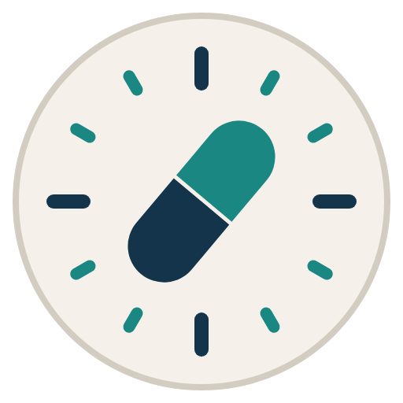
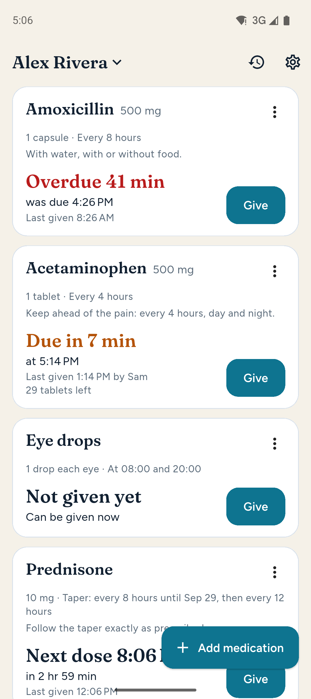
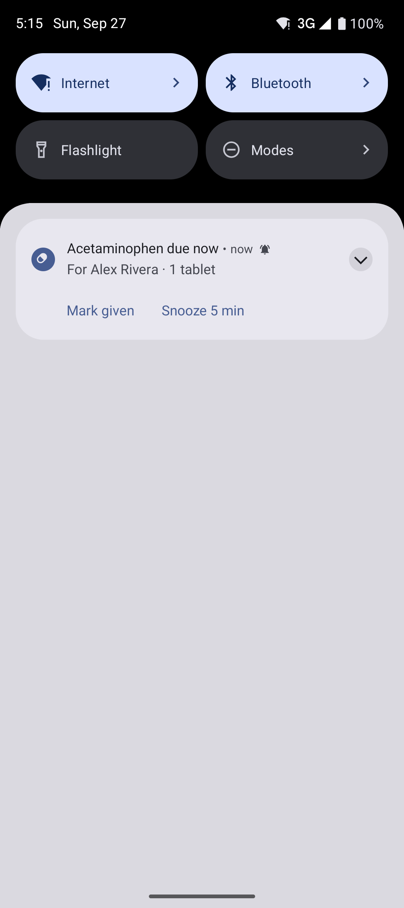
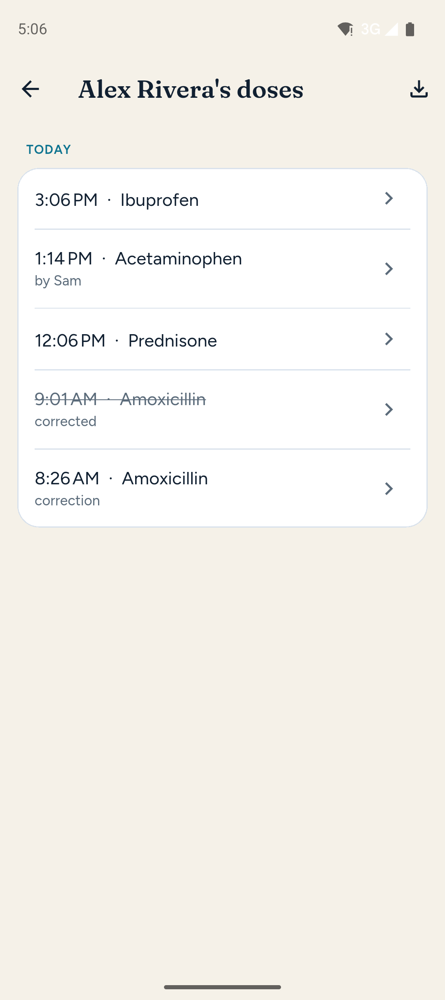
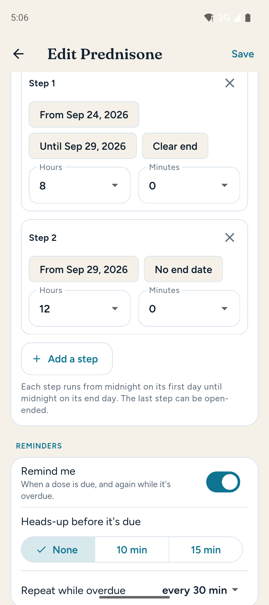

<div align="center">
  
  <h1>Nexpill</h1>
  <p>Medication reminders that arrive on time. Your records stay on your phone.</p>
</div>

A medication timing tracker for caregivers. It answers, at a glance:

- When is this medication next due?
- Can it be given now?
- What was already given, and when?

…and reminds you when a dose is due, with alarms the phone schedules itself.
Everything stays on your phone: no account, no server, and no internet
permission.

<p align="center">
  
  
  
  
</p>
<p align="center"><sub>Screenshots use fictional data.</sub></p>

**Public beta.** Download the latest release from
[nexpill.superdavelab.com](https://nexpill.superdavelab.com/). Nexpill replaces
an earlier web version whose reminders couldn't be relied on; see
[docs/port-from-pwa.md](docs/port-from-pwa.md) for how the port went.

## Why Nexpill exists

Nexpill was written by a caregiver, for caregivers. It grew out of helping
look after a family member through a serious illness, where keeping ahead of
pain meant giving medication on a strict schedule — and where tired people
doing time arithmetic in the middle of the night, with nothing to remind
them, sometimes got it wrong. Then came a taper from one medication to
another, on a schedule that changed by the day. Those slips meant more pain
than there needed to be.

So Nexpill does one job carefully: knowing exactly when the next dose can be
given, and saying so at the right moment. And it will always be **free and
open source** — no price, no premium tier, no account, no ads. Nobody caring
for someone should have to pay for, or give up their privacy for, a tool that
keeps a dose from being late.

## What it handles

- Schedules every few hours (including odd intervals like 4 h 45 m), at set
  times of day, as needed with a minimum gap, and tapers that change
  interval by date.
- Several patients, each with their own medications.
- Corrections that replace a mistaken entry without erasing it.
- Remaining supply, with a low-supply warning.

## Privacy

Your data is written to a database on your phone and nowhere else. Release
builds have no `INTERNET` permission, so Android itself prevents the app from
sending anything — check the permission list. No analytics, no ads, and
excluded from Android's cloud backup. See [docs/privacy.md](docs/privacy.md).

*Nexpill tracks timing. It does not give medical advice, recommend doses or
check interactions.*

## Development

Requires Flutter (version pinned in `.github/workflows/ci.yml`) and the
Android SDK.

```bash
flutter pub get
flutter test
flutter analyze
flutter run
```

Releases: [docs/RELEASING.md](docs/RELEASING.md). Plans:
[docs/roadmap.md](docs/roadmap.md).

## Licence

Copyright (C) 2026 Dave Koons

Nexpill is free software: you can redistribute it and/or modify it under the
terms of the GNU General Public License as published by the Free Software
Foundation, either version 3 of the License, or (at your option) any later
version. It is distributed in the hope that it will be useful, but WITHOUT
ANY WARRANTY; without even the implied warranty of MERCHANTABILITY or
FITNESS FOR A PARTICULAR PURPOSE. See [LICENSE](LICENSE) for the full text.

Version 0.1.0 was released under the MIT licence.
